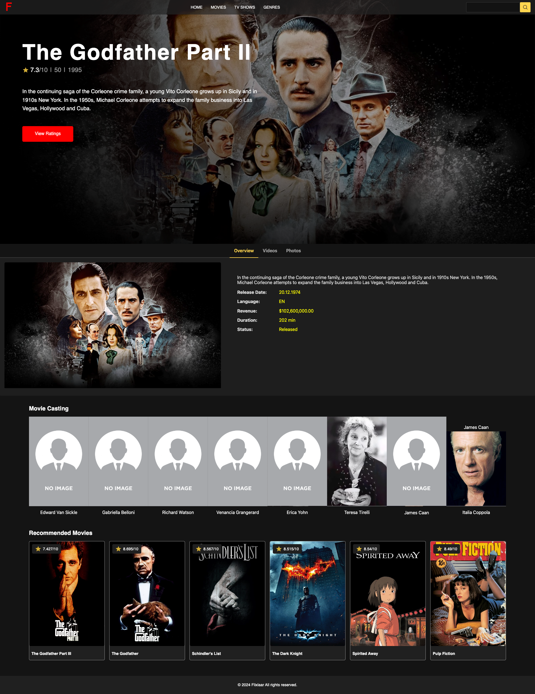

### Movie Home Page

### Movie Details Page

# Movies Website

Welcome to our Movies Website repository! This project is a dynamic website where users can explore a vast collection of movies, view detailed information about each movie, watch trailers, discover casting details, and receive recommendations based on their preferences.

## Features

- **Movies Listing:** Browse through a wide range of movies with ease.
- **Movie Details:** View comprehensive details about each movie, including synopsis, ratings, and release date.
- **Casting:** Explore the cast and crew members associated with each movie.
- **Videos and Photos:** Watch trailers and view photos related to the movies.
- **Recommendations:** Receive personalized movie recommendations based on your preferences.

## Technologies Used

- Angular: Frontend framework for building dynamic web applications.
- HTML/CSS/JavaScript: Core technologies for web development.
- [Insert other technologies used, e.g., Bootstrap, TypeScript, etc.]

## Installation

To run this project locally, follow these steps:

1. Clone the repository:
   https://github.com/apu-chakraborty/movies-app.git

2. Navigate to the project directory:
   `cd movies-app`
3. Install dependencies:
4. Start the development server:
   `ng serve`
5. Open your web browser and visit http://localhost:4200 to view the website.

## Screenshots

[Insert screenshots of the website here]
